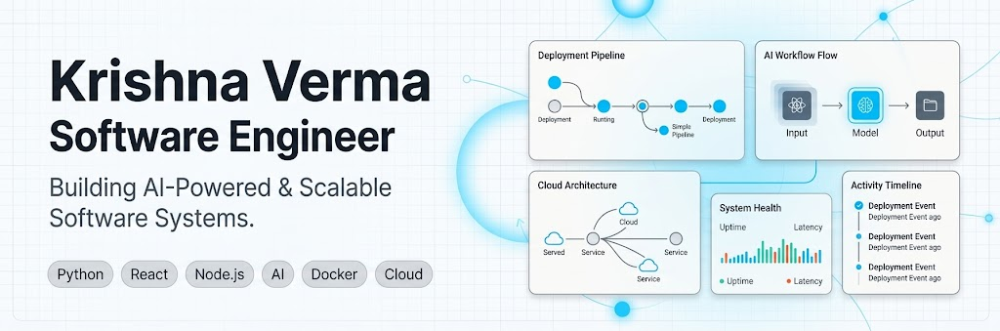
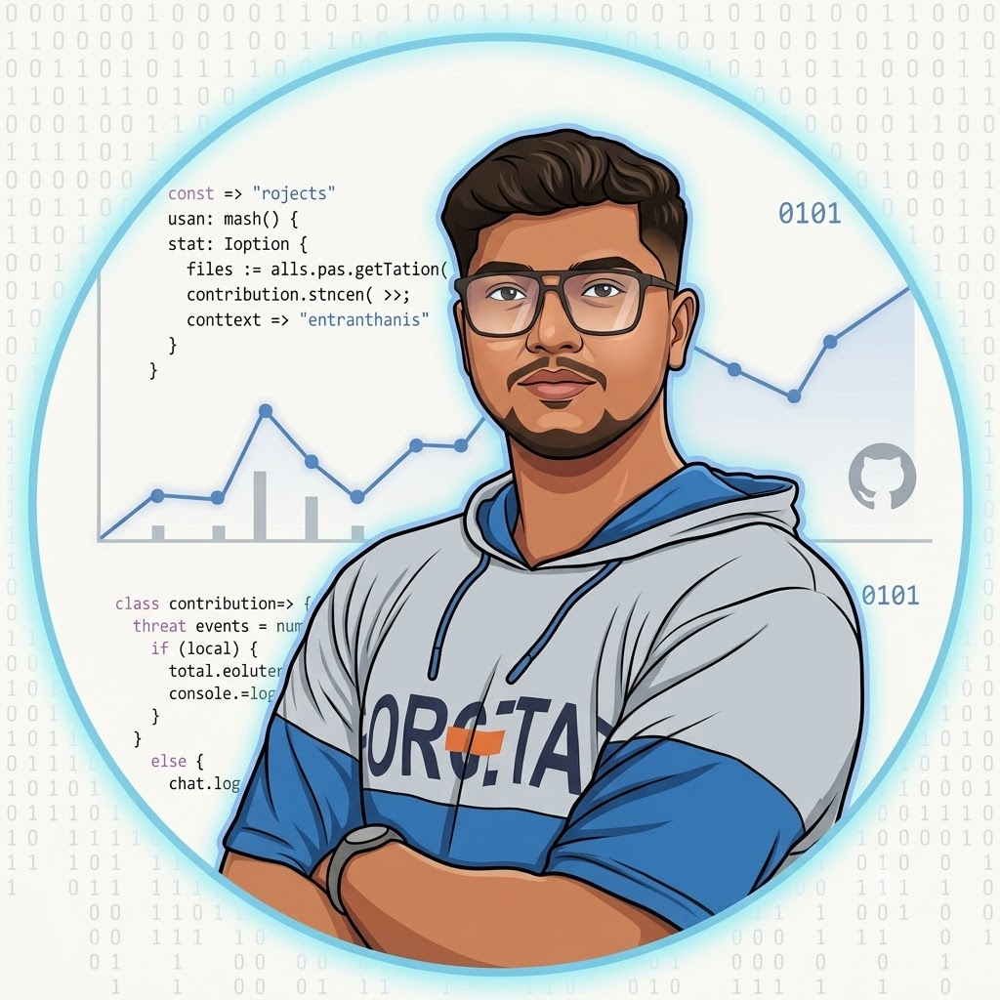

  

 
 
 

  

  
 

# Krishna Verma

### Software Engineer • AI Builder

 

Building software that is scalable, reliable, and designed for real-world impact.

 
 

 
 

---

 

🚀 **Currently Building**

### OpenDeploy
Exploring containerized deployments, CI/CD workflows, and developer infrastructure through a Vercel-inspired deployment platform.

 

---

## ⚙️ Engineering Philosophy

I focus on building software that solves concrete problems, prioritizing systems understanding over framework familiarity. When designing projects like OpenDeploy or backend components, my goal is to write clean, reliable code that makes sense to read and holds up under load. I believe that simplicity in architecture is the key to scalability.

Rather than just writing code to meet a specification, I enjoy digging into how systems work beneath the hood, especially in distributed environments and cloud infrastructure. For me, good engineering means designing systems that are maintainable, performant, and ultimately useful to real people.

---

## 🛠 Tech Stack

  <!-- Skillicons.dev for clean tech stack rendering -->
  

---

## 🏗 Featured Projects

#### 🚀 Developer Tools
* **[OpenDeploy](https://github.com/krishnaverma09/OpenDeploy)** – A self-service deployment platform that builds and hosts web applications directly from Git repositories.
   *Stack:* `Node.js` • `Docker` • `Express` • `Git` • `Linux` • Coming Soon

#### 🤖 Artificial Intelligence
* **[Nextflix](https://github.com/krishnaverma09/Nextflix)** – A content discovery engine that delivers personalized recommendations based on user interaction history.
   *Stack:* `Python` • `FastAPI` • `SQL`

#### 🌐 Full-Stack Applications
* **[Doubtly](https://github.com/krishnaverma09/Doubtly)** – A campus collaboration platform for student study group organization and resource sharing.
   *Stack:* `React` • `Node.js` • `Express` • `PostgreSQL` • [Live Demo](https://doubtly-mu.vercel.app/)
* **[SocietyConnect](https://github.com/krishnaverma09/society-connect)** – A management portal that centralizes resident billing, requests, and communication for housing societies.
   *Stack:* `React` • `Node.js` • `MongoDB` • `Express`

 

> Most of my work focuses on building developer tools, AI-powered applications, backend systems, and full-stack products. Explore my repositories to see implementation details and ongoing improvements.

---

## 📊 Analytics

  
  

 

  <h3>📈 Top Languages</h3>
  

 

  <h3>🐍 Contribution Graph</h3>
  <picture>
    <source media="(prefers-color-scheme: dark)" srcset="https://raw.githubusercontent.com/krishnaverma09/krishnaverma09/output/github-contribution-grid-snake-dark.svg">
    <source media="(prefers-color-scheme: light)" srcset="https://raw.githubusercontent.com/krishnaverma09/krishnaverma09/output/github-contribution-grid-snake.svg">
    
  </picture>

---

## 🌐 Coding Profiles

  

---

## 📚 Currently Learning

- Distributed Systems
- Cloud Infrastructure
- Kubernetes
- AI Engineering
- System Design

---

## 🤝 Let's Connect

I'm always interested in discussing software engineering, AI, developer tools, and building impactful products.

Feel free to reach out if you'd like to collaborate or exchange ideas.

 

  

